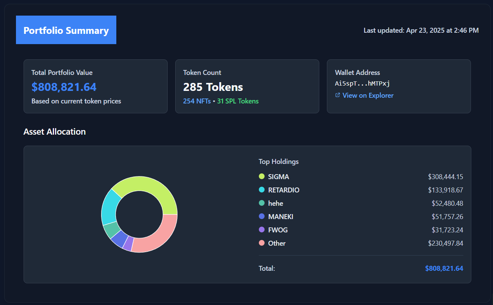

# Solana Portfolio Tracker

A cutting-edge Solana portfolio tracking application that provides advanced real-time token insights with intelligent data visualization and user-centric design.



## Key Features

- **Real-time Token Tracking**: Track your Solana tokens with accurate, up-to-date pricing information
- **Advanced Liquidity Filtering**: $10,000+ liquidity filtering to ensure only quality tokens are displayed
- **Interactive Portfolio Visualization**: Dynamic token allocation charts and performance metrics
- **One-Click Copy**: Easily copy token mint addresses with a simple click
- **Proxy Protection**: Built-in proxy rotation system to prevent API rate limiting
- **Responsive Design**: Works perfectly on mobile, tablet, and desktop devices

## Tech Stack

- **Frontend**: React, TypeScript, Tailwind CSS, shadcn/ui
- **Backend**: Express.js, Node.js
- **Blockchain Integration**: Solana Web3.js
- **APIs**: Jupiter API for token prices, DexScreener for liquidity verification
- **Data Visualization**: Recharts for portfolio allocation charts
- **Caching**: Server-side caching system with intelligent cache invalidation

## Getting Started

### Prerequisites

- Node.js 16+ 
- A proxy service account (like Oxylabs) for production deployment

### Installation

1. Clone this repository:
   ```
   git clone https://github.com/yourusername/solana-portfolio-tracker.git
   cd solana-portfolio-tracker
   ```

2. Install dependencies:
   ```
   npm install
   ```

3. Set up environment variables:
   Create a `.env` file in the root directory with the following variables:
   ```
   OXYLABS_PROXY_USERNAME=your_username
   OXYLABS_PROXY_PASSWORD=your_password
   ```

4. Start the development server:
   ```
   npm run dev
   ```

5. Access the application at `http://localhost:5000`

## Usage

1. Enter a valid Solana wallet address in the search bar
2. View your token holdings, including balances, prices, and total values
3. Explore the allocation chart to see distribution of assets
4. Click on token names to copy their mint addresses

## API Endpoints

- `GET /api/portfolio/:address` - Retrieve portfolio data for a given Solana wallet address

## Deployment

This application can be deployed to any Node.js hosting service:

1. Build the production version:
   ```
   npm run build
   ```

2. Start the production server:
   ```
   npm start
   ```

## Roadmap

- [ ] Add token price history charts
- [ ] Implement wallet connection with Phantom and other wallets
- [ ] Add transaction history tracking
- [ ] Include NFT support
- [ ] Add portfolio comparison features

## Contributing

Contributions are welcome! Please feel free to submit a Pull Request.

## License

This project is licensed under the MIT License - see the LICENSE file for details.

## Acknowledgments

- Jupiter API for token price data
- DexScreener for liquidity information
- Solana Labs for the blockchain infrastructure